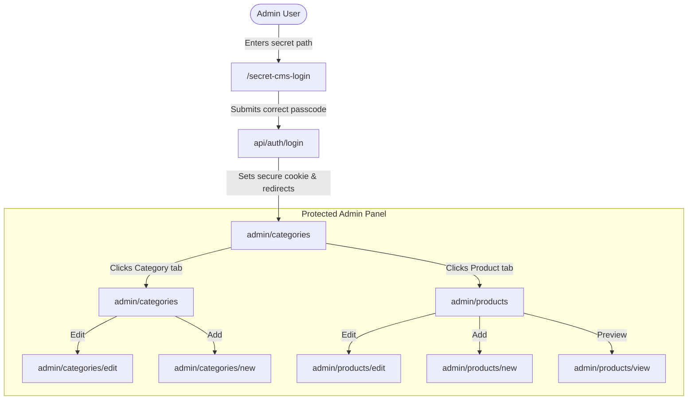

# WAE Content Management System (CMS) - Phase 1 Documentation

This document describes the architecture, security configurations, database layer, and administration views implemented for Phase 1 of the WAE CMS.

---

## 1. System Architecture

The WAE CMS is designed as a secure, fast, and completely **Git-backed headless CMS** built natively within Next.js.



### 🔒 Access Control & Route Security
* **Intruder Guard Middleware**: Configured Edge-Runtime [middleware.ts](file:///Users/harshit/Desktop/WAE%20new/middleware.ts) protecting all `/admin/*` and `/api/admin/*` paths.
* **404 Masking**: Any unauthorized access request is immediately rewritten to Next.js's standard `404 Not Found` page instead of displaying unauthorized pages.
* **HMAC-SHA256 Session Token**: Zero-dependency session authentication helpers in [lib/auth.ts](file:///Users/harshit/Desktop/WAE%20new/lib/auth.ts) built using the browser-native Subtle Crypto API.

---

## 2. Git-Backed Database Layer

To eliminate external database hosting, latency, and costs, the CMS manages all data within the local static typescript codebase.

* **Dev Environment**: API endpoints read and rewrite [data/products.ts](file:///Users/harshit/Desktop/WAE%20new/data/products.ts) locally. Next.js instantly hot-reloads the pages.
* **Prod Environment**: API writes commit the updated [data/products.ts](file:///Users/harshit/Desktop/WAE%20new/data/products.ts) back to the repository via the GitHub REST API using the configured `GITHUB_ACCESS_TOKEN`. This automatically triggers a redeployment.

---

## 3. Data Schema & Models

### Categories (`CategoryData`)
```typescript
export interface CategoryData {
  id: string;
  title: string;
  description: string;
  imageUrl?: string;
  paragraphs: string[];
  products: Product[];
}
```

### Products (`ProductDetails`)
```typescript
export interface ProductDetails {
  id: string;
  name: string;
  categoryName: string;
  heroSubtitle: string;
  images: string[];
  featuresList: Array<{ title: string; description: string }>;
  specifications: {
    storageCapacity: SpecRow[];
    waterTemp: {
      cold: string;
      hot: string;
    };
    greenCertification: string;
    dripTray: string;
    refrigerant: string;
    dimensions: DimensionRow[];
    powerRequirement: string;
    purificationSystem: string;
    pointOfUseSterilization: string;
  };
  status?: 'Live' | 'Draft';
}
```

---

## 4. Admin Management Views

All Admin components are located under `app/admin/` and styled with a premium dark theme matching WAE's design language.

1. **Secret Login** (`/secret-cms-login`): A passcode-protected access gate.
2. **Dashboard Layout**: Uses [sidebar.tsx](file:///Users/harshit/Desktop/WAE%20new/components/admin/sidebar.tsx) and [header.tsx](file:///Users/harshit/Desktop/WAE%20new/components/admin/header.tsx) to provide search capabilities and category/product navigation.
3. **Categories Manager** (`/admin/categories`):
   * Add/Edit forms with dynamic Cloudflare CDN preview cards.
   * Unsaved changes checking on form exits.
4. **Products Manager** (`/admin/products`):
   * Product table listing with search query, parent category filter, and live/draft status.
   * Form inputs to support adding/removing spec rows, up to 4 image URLs with previews, and features list configurations.
5. **Interactive Preview** (`/admin/products/[id]/view`):
   * Render preview showcasing actual image gallery slider and specifications block layout.
